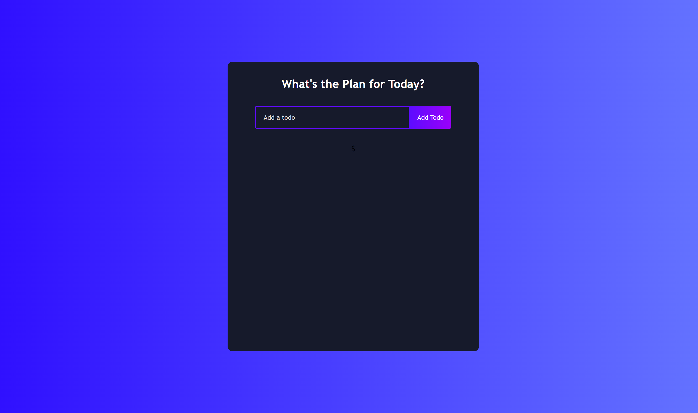

# Not Create React App

The **not-create-react-app** project is a [template repository](https://docs.github.com/en/repositories/creating-and-managing-repositories/creating-a-template-repository) which does **NOT** use [create-react-app](https://github.com/facebook/create-react-app) to show you how simple it is to setup a React project yourself.

## Screenshot

## Resources

This template repository is built on insights from:

- [Getting Started with React](https://slideshare.net/bennyneugebauer/getting-started-with-react-v16)
- [Use React with TypeScript](https://typescript.tv/react/use-react-with-typescript/)
- [6 ways to configure Webpack](https://dev.to/typescripttv/6-ways-to-configure-webpack-5a33)
- [Jest Workshop](https://github.com/bennycode/workshop-jest)
- [React Todo List App](https://www.youtube.com/watch?v=E1E08i2UJGI)

## Maintainers

[![Benny Neugebauer on Stack Exchange][stack_exchange_bennycode_badge]][stack_exchange_bennycode_url]

[stack_exchange_bennycode_badge]: https://stackexchange.com/users/flair/203782.png?theme=default
[stack_exchange_bennycode_url]: https://stackexchange.com/users/203782/benny-neugebauer?tab=accounts
